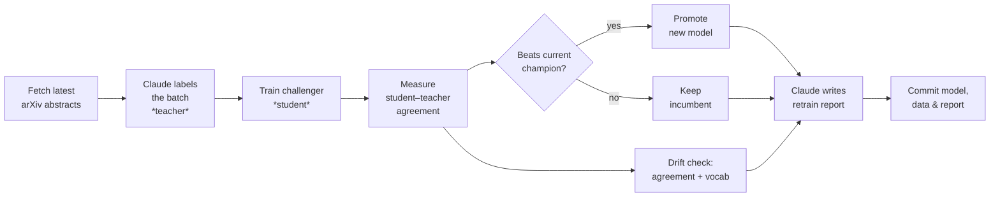

# Self-Distilling Classifier

A lightweight text classifier that **learns to imitate Claude on a live data
stream** — and **retrains itself** when the stream drifts.

Big models are accurate but expensive to run at scale. This pipeline uses
Claude as a *labeling oracle* (the teacher) to continuously train a cheap,
fast local model (the student). Every run pulls fresh data, has Claude label
it, retrains the student, and **promotes the new model only if it beats the
current one**. When the world moves — new topics, new vocabulary — a scheduled
retrain catches the student up, and Claude writes a plain-English report on
what changed.

The whole thing runs on a **GitHub Actions schedule**, so the commit history of
this repo *is* the training history. No servers, no infrastructure.

## How it works



**Champion / challenger.** Each run trains a fresh *challenger* on all data
gathered so far and evaluates it on the newest batch. It replaces the
*champion* in production only if its agreement with the teacher is at least as
good — so the model never silently gets worse.

**Two drift signals.** *Agreement drift* flags when the student suddenly falls
behind the teacher's recent average (the stream moved). *Vocabulary drift*
measures how much of a batch's language is brand new (new topics appearing).

## Quick start

```bash
pip install -r requirements.txt

# Test the whole loop locally with zero cost — a keyword heuristic stands in
# for Claude, so you need no API key to see it run end to end:
python src/run_pipeline.py --mock

# Real run: Claude does the labeling and writes the report.
export ANTHROPIC_API_KEY=sk-ant-...
python src/run_pipeline.py
```

Run it a few times. Watch `models/metrics_history.json` grow, the champion get
promoted, and a fresh changelog appear in `reports/latest.md`.

## Automate it (the whole point)

1. Push this repo to GitHub.
2. **Settings → Secrets and variables → Actions → New repository secret**:
   add `ANTHROPIC_API_KEY`.
3. **Settings → Actions → General → Workflow permissions**: enable
   *Read and write permissions* (so the job can commit results back).
4. Open the **Actions** tab and run *self-distilling-retrain* once by hand
   (the "Run workflow" button) to confirm it works. After that it runs daily
   on the schedule in [`.github/workflows/retrain.yml`](.github/workflows/retrain.yml).

Each scheduled run shows up as a commit — a visible, honest record that the
system trains itself.

## Make it yours

The single most important line is `task_question` in
[`config.yaml`](config.yaml). Rewrite it and you change what the model learns —
no code changes needed. A few directions:

- classify papers by subfield instead of a yes/no topic
- swap the source in `src/fetch_data.py` (Hacker News, RSS, a news API)
- predict something with a business angle (support tickets by urgency, etc.)

## Upgrade paths

Once the base version runs, these are natural next steps that each make a
strong talking point:

- **Embeddings student.** Replace TF-IDF in `src/student.py` with
  `sentence-transformers` (`all-MiniLM-L6-v2`) for better semantic accuracy.
- **Cost tracking.** Log teacher tokens per run and chart the student's
  inference cost vs calling Claude every time — quantify the savings.
- **Confidence-based labeling.** Only spend a teacher call when the student is
  unsure (active learning), cutting labeling cost further.

## Layout

```
config.yaml                  task, data source, thresholds
src/fetch_data.py            pull latest arXiv abstracts (no key)
src/label_teacher.py         Claude labels the batch (mock mode available)
src/student.py               TF-IDF + LogisticRegression student
src/drift.py                 agreement & vocabulary drift
src/report.py                Claude-written run report
src/run_pipeline.py          orchestrates one full run
.github/workflows/retrain.yml  the scheduled automation
```

## Stack

Python · scikit-learn · Anthropic Claude API · GitHub Actions · arXiv API
